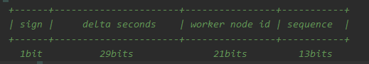

# platform

#### 介绍
主要包含通用模块和基础服务，如通用DTO模块，通用工具类模块、ID生成器服务等

#### 一、通用模块
`common-dto` - 通用DTO模块 

> 将系统间通信的参数格式统一起来，也就是标准化。

`common-util` - 通用工具类模块 

> 主要常用工具类。

#### 二、基础服务

`base-service` 模块为基础服务模块。

`id-generator-service` 产号服务。

>1、分布式ID - 基于改造版本的雪花算法生成
>
>> 1、ID长度有64位，等于一个long类型字段的长度；
>>
>> 2、ID分配规则如下：
>>
>> 
>>
>> **sign**: 符号位，也就是最高位为0；
>>
>> **delta seconds**: 增量秒，长度30位，表示自2019-12-01 00:00:00.000以来的增量秒，可支撑约17年，截至 2036-12-04 18:48:31；
>>
>> **worker id**: 机器id，长度21位，机器id基于数据库分配，最大机器id约为209W；
>>
>> **sequence**: 序列号，长度13位，表示同一秒内的序列号，最大值为8191/s；
>
>2、商户号
>
>3、用户ID
>
>4、订单号

##### 后续规划

`sms-service` 短信服务

> 1、支持多短信通道切换
>
> 2、支持各种限流规则
>
> 同一手机号一天最多发送短信数量
>
> 同一手机号5分钟内发送短信数量
>
> 短信有效期

`pay-service` 支付服务

> 1、支持多支付通道
>
> 2、支持微信、支付宝支付
>
> 3、支持简单快速的接入其他支付通道
>
> 4、支付回调处理成功后，通过MQ与具体业务解耦

`account-service` 核心账户服务

> 用于作为积分账户体系，用户余额账户体系。